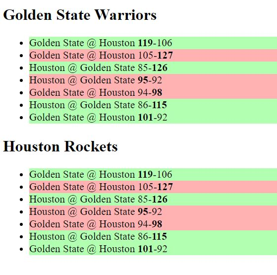

# NBA History Games

### Screenshot

## My process

Hi, this is a 'following along project' from the Javascript course i've been working on. This is the first practice project after
learning the fundamentals and some DOM elements.

### How the project works

So, this is basicallly a Score Chart, where winner team will have a green background, while defeated team will be displayed as red.
Also the higher score team (winner) will be displayed as a bold text

### Built with

- Javascript
